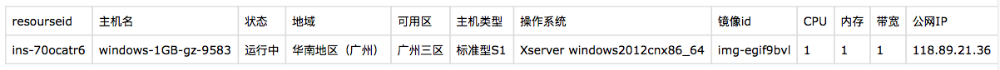

# Jenkins-automatically-builds

### 🤔 Use Jenkins to set up a persistent build environment

> 1. 申请一台服务器, 以下操作在服务器中进行（我这里使用的是腾讯云的 `windows2012cnx86_64`）
> 
> 
> 
> 2. 下载 `JDK1.5` 及以上版本，并配置好环境变量
> 
> 3. 下载 `Tomcat7` 及以上版本
> 
> 4. 下载 `jenkins.war` 包 （jenkins有两种版本，一种是可安装程序，一种是war包，这里使用war包） 

***

### 🐶 The preparation has been completed, and now we're starting to configure Jenkins

* 启动Tomcat


* 将 jenkins 放置Tomcat/webapps/ 目录下

```
---
服务器端打开浏览器，输入:http://localhost:8080/jenkins（初始化时间比较久）

初始化完成后页面有个大大的：Unlock Jenkins

这时候我们按照提示的目录信息打开该本地路径，该路径下有个 `.txt` 文件，输入即可解锁。
---
```

* 这时候我们可以直接访问服务器的公网地址了 `xxx.xxx.xxx.xxx:8080/jenkins` (*需要加上端口号*)

### **👀 创建一个item** ***（以下操作在本地操作）***


* 此时构建会报 `git 链接错误`，因为我们还需要：

```
	1. 在jenkins中配置 Git plugin 插件
	2. 在服务器端下载 git
	3. 在服务器端安装 node.js 环境
	4. 安装淘宝镜像 cnpm
```

### 配置 Git plugin 插件

* 进入首页面板 
* 点击系统管理
* 点击管理插件 
* 点击可选插件
* 搜索 Git plugin 安装即可

### 配置服务器 git 环境

* 下载 [git](https://www.git-scm.com/downloads) 安装包
* 安装成功后，打开 git bash
	* git version *（查看 git 当前版本）*
	* where git *（查看 git 本地路径）*
* 复制 git 的服务器端的本地路径
* 进入 jenkins 系统管理 > 全局工具配置
* 在 Git 选项中粘贴路径
 

### 配置 node.js 环境

* 下载 [node.js](http://nodejs.cn/download/)
* 一直 next 即可

### 安装淘宝镜像

* 打开 cmd 输入 `npm install -g cnpm --registry=http://registry.npm.taobao.org`

---
> 配置到这里，我们对 test 项目点击构建即可。构建成功后打开工作空间，就会发现里面我们想要的 dist 文件夹以及 index.html 文件

---
<br/>
* 此时我们的需求是：通过域名来访问构建好的项目

```
	1. 安装 Apache 环境或者 Nginx 环境
	2. 将默认的访问路径设置为 jenkins 默认路径的 workspace 目录下
	3. 修改用户访问权限（必须配置）
```

### 配置 Apache 环境

* 下载 `wampserver` 或者 `XAMPP` *(本人使用wampserver)*
	* 这时候打开它可能提示`MSVCP110.dll丢失`，解决方法：打开 [http://www.microsoft.com/zh-CN/download/details.aspx?id=30679](http://www.microsoft.com/zh-CN/download/details.aspx?id=30679)，下载安装即可
	* 安装完成后打开 wampserver 会提示 `缺少vcruntime140.dll` 巨坑！！！ 解决方法：打开 [https://www.microsoft.com/en-US/download/details.aspx?id=48145](https://www.microsoft.com/en-US/download/details.aspx?id=48145)，下载安装即可

	* 这时候 Apache 的状态一直是黄色的，说明启动失败，我们只需将 `wampserver`卸载掉，重新安装一遍即可解决。
* 配置 `httpd-vhosts.conf` 文件 ， 路径为: `C:\wamp\bin\apache\apache2.4.23\conf\extra\httpd-vhosts.conf`


* 输入域名即可访问

### 配置 Nginx 环境
> 后续补上~

## 🤔 小结

软件产品的系统架构日益复杂，迭代周期越来越短。而每次产品版本发布前都需要对代码进行手动集成，使得开发人员、测试人员经常要花大量时间在产品集成上。一旦集成过程中出现问题就有可能导致产品发布延期，因此 Jenkins 的持续集成解决方案将会被更多的企业所采用。

## License

[MIT](https://opensource.org/licenses/MIT)